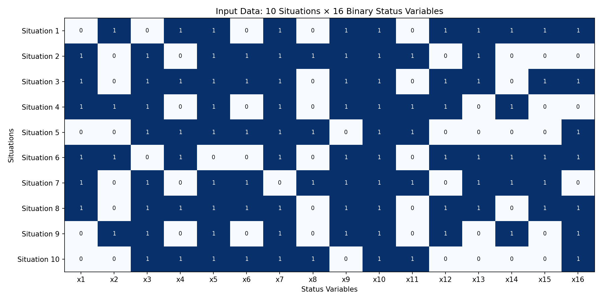

# HW6: Adaptive Resonance Theory (ART-1) 實作報告

## 作業要求與理論背景

這次作業的主題是 Adaptive Resonance Theory，一般簡稱 ART，中文可以翻譯成「自適應共振理論」。這個演算法是由 Stephen Grossberg 和 Gail Carpenter 在 1980 年代提出的，它在神經網路的發展史上佔有一個獨特的地位，因為它試圖解決一個困擾所有學習系統的根本問題：**穩定性-可塑性兩難（Stability-Plasticity Dilemma）**。

什麼是穩定性-可塑性兩難呢？想像一下你的大腦。你的大腦需要能夠學習新的東西（可塑性），但同時也需要記住舊的東西（穩定性）。問題是，這兩個需求往往是互相矛盾的。如果一個系統太有可塑性，它學新東西的時候可能會把舊的東西給忘掉。如果一個系統太穩定，它就很難學習新的知識。大部分的神經網路都會遭遇這個問題，學術上叫做「災難性遺忘（Catastrophic Forgetting）」——當你用新資料訓練網路的時候，網路可能會完全忘記之前學過的東西。

ART 的設計目標就是要同時滿足穩定性和可塑性。它的核心思想是：只有當輸入資料跟網路已經學到的知識「足夠相似」的時候，才會更新那個知識；如果輸入資料跟所有已知的知識都不夠相似，那就創建一個全新的類別來儲存這個新知識，而不去動原本的類別。這樣一來，舊的知識不會被新的學習破壞，同時網路又保有學習新東西的能力。

ART 有好幾個版本。ART-1 是最基本的版本，專門處理**二元輸入**（也就是只有 0 和 1 的向量）。後來還有 ART-2（處理連續值輸入）、ART-3、Fuzzy ART、ARTMAP 等等各種變體。這次作業我實作的是 ART-1，因為它的概念最清楚，數學也最簡潔，很適合用來理解 ART 家族的核心思想。

要理解 ART-1 在做什麼，我覺得可以用一個「嚴格的圖書館員」的比喻。想像有一個圖書館員負責把書分類放到不同的書架上。當一本新書進來的時候，圖書館員會這樣做：

1. 先掃一眼所有的書架，找出看起來最適合放這本書的那個書架
2. 仔細比對這本新書跟那個書架上的書是不是真的夠像
3. 如果夠像，就把這本書放進去，然後更新這個書架的「代表性」（可能會變得更通用一點）
4. 如果不夠像，就把這個書架暫時標記為「不適合」，然後回到步驟 1 找下一個最適合的書架
5. 如果試遍了所有書架都不夠像，那就**開一個新書架**專門放這本書

這裡的「夠不夠像」是由一個叫做**警戒參數（Vigilance Parameter）**的數值 ρ 來控制的。ρ 越高，圖書館員越嚴格，要求的相似度越高，結果就是會開出很多書架（很多類別）。ρ 越低，圖書館員越寬鬆，稍微有點像就放進去了，結果就是只會有少數幾個很大的書架。

### ART-1 的網路架構

ART-1 的架構跟一般的前饋神經網路很不一樣，它是一個**雙層互動**的架構：

```
         ┌─────────────────────────────────────┐
         │         F2 層（辨識層）              │
         │    每個神經元代表一個學習到的類別    │
         │         [N₁]  [N₂]  [N₃] ...        │
         └───────────▲───────┬─────────────────┘
                     │       │
            W^(f)    │       │    W^(b)
          前饋權重    │       │   回饋權重
         「哪個類別   │       │  「這個類別
          最匹配？」  │       │   長什麼樣？」
                     │       │
         ┌───────────┴───────▼─────────────────┐
         │         F1 層（比較層）              │
         │      接收輸入，與 F2 的回饋比較       │
         │    [x₁][x₂][x₃]...[x₁₆]             │
         └─────────────────────────────────────┘
                     ▲
                     │
               輸入模式
          （例如 [0,1,0,1,1,0,...]）
```

**F1 層（比較層，Comparison Layer）**：有 n 個神經元，對應輸入的 n 個特徵。在這次作業中 n = 16，因為每個工業製程狀態有 16 個二元狀態變數。F1 層的任務是接收輸入，同時也接收 F2 層傳回來的「期望」，然後比較這兩者是否匹配。

**F2 層（辨識層，Recognition Layer）**：有 m 個神經元，每個神經元代表一個已經學習到的類別。m 是動態變化的——一開始可能只有 1 個神經元，隨著訓練的進行，如果遇到跟現有類別都不夠像的輸入，就會新增神經元。

**兩組權重**：

- **前饋權重 W^(f)**：從 F1 指向 F2，是實數值。用來計算每個 F2 神經元對輸入的「反應強度」，反應最強的那個就是候選贏家。
- **回饋權重 W^(b)**：從 F2 指向 F1，本質上是二元值（0 或 1）。儲存的是每個類別的「原型模式」，也就是這個類別「期望」看到什麼樣的輸入。

這種雙向連接的架構讓 ART-1 可以進行「假設-驗證」的推理：F2 先根據前饋訊號提出一個假設（「我覺得這個輸入屬於類別 k」），然後透過回饋權重把這個假設傳回 F1 進行驗證（「類別 k 的原型長這樣，你看輸入跟它像不像？」）。如果驗證通過，就進入「共振」狀態，學習發生；如果驗證失敗，就重置這個假設，嘗試其他類別。

### 數學公式

讓我們把 ART-1 的運作過程用數學公式精確地描述出來。

**符號定義**：
- n：輸入特徵數（F1 層神經元數）
- m：類別數（F2 層神經元數），動態變化
- x：輸入模式，一個 n 維的二元向量 [x₁, x₂, ..., xₙ]
- ρ：警戒參數，0 < ρ < 1
- W^(f)：前饋權重矩陣，大小 m × n
- W^(b)：回饋權重矩陣，大小 n × m
- ‖x‖：向量 x 的「範數」，對於二元向量就是 1 的個數，即 Σxᵢ

**權重初始化**：

訓練開始前，所有權重要先初始化：

$$W^{(f)}_{ji} = \frac{1}{1 + n} \quad \text{對所有 } j \in \{1,...,m\}, i \in \{1,...,n\}$$

$$W^{(b)}_{ij} = 1 \quad \text{對所有 } i \in \{1,...,n\}, j \in \{1,...,m\}$$

前饋權重初始化成 1/(1+n) 是有講究的。這個值確保了一個「未承諾」的新神經元不會自動贏過已經學習過特定模式的神經元。回饋權重初始化成全 1，意思是一開始每個類別的原型是「什麼都有可能」，隨著學習進行會逐漸變得更具體。

**Phase 1：計算激活值（辨識）**

當輸入 x 進來時，計算每個 F2 神經元的激活值：

$$u_j = \sum_{i=1}^{n} W^{(f)}_{ji} \cdot x_i = \mathbf{W}^{(f)}_j \cdot \mathbf{x}$$

這就是一個簡單的內積。激活值最高的神經元就是「候選贏家」：

$$k = \arg\max_j \{u_j\} \quad \text{（在未被禁用的神經元中）}$$

**Phase 2：警戒測試（比較）**

找到候選贏家 k 之後，要進行警戒測試來驗證這個匹配是否「夠好」。

首先計算輸入 x 和類別 k 的原型（儲存在 W^(b) 的第 k 列）的交集：

$$\mathbf{W}^{(b)}_k \land \mathbf{x}$$

這裡的 ∧ 是逐元素的 AND 運算。對於二元值來說，AND 就是乘法：1∧1=1, 1∧0=0, 0∧1=0, 0∧0=0。

然後計算相似度比值 R：

$$R = \frac{\|\mathbf{W}^{(b)}_k \land \mathbf{x}\|}{\|\mathbf{x}\|} = \frac{\sum_i W^{(b)}_{ik} \cdot x_i}{\sum_i x_i}$$

這個比值的意義是：「輸入中有多少比例的 1 也出現在原型中？」

- 分子：輸入和原型**共同**為 1 的位置數
- 分母：輸入為 1 的位置數

**警戒測試**：

$$\text{如果 } R > \rho: \text{通過，進行學習}$$
$$\text{如果 } R \leq \rho: \text{失敗，禁用此神經元，繼續搜尋}$$

**Phase 3：搜尋**

如果警戒測試失敗，就把神經元 k 暫時禁用（只針對當前這筆輸入），然後回到 Phase 1 找下一個激活值最高的神經元。重複這個過程直到：
- 找到一個通過警戒測試的神經元，或者
- 所有神經元都被禁用了

**Phase 4：學習（權重更新）**

如果找到了通過警戒測試的神經元 k，就更新它的權重：

**回饋權重更新**（原型更新）：

$$W^{(b)}_{ik}(\text{new}) = W^{(b)}_{ik}(\text{old}) \cdot x_i$$

這是一個 AND 運算。新的原型只保留「舊原型和新輸入都為 1」的位置。這意味著原型只會越變越「小」（1 的數量只會減少或不變，不會增加），變得越來越具體，只保留這個類別所有成員的共同特徵。

**前饋權重更新**：

$$W^{(f)}_{ki}(\text{new}) = \frac{W^{(b)}_{ik}(\text{new}) \cdot x_i}{0.5 + \sum_j W^{(b)}_{jk}(\text{new}) \cdot x_j}$$

或者更簡潔地寫成：

$$W^{(f)}_{ki}(\text{new}) = \frac{(\mathbf{W}^{(b)}_k \land \mathbf{x})_i}{0.5 + \|\mathbf{W}^{(b)}_k \land \mathbf{x}\|}$$

分母中的 0.5 是一個常數，它的作用是打破平手的情況，讓原型更具體（1 的數量更少）的類別在競爭中佔優勢。

**Phase 5：新增神經元**

如果所有現有神經元都沒通過警戒測試，就新增一個神經元到 F2 層：

1. m → m + 1
2. 初始化新神經元的權重（跟一開始一樣）
3. 立刻對這個新神經元執行 Phase 4 的權重更新

這樣新神經元的原型就會直接設定成當前這筆輸入，專門負責這種新類型的模式。

### 警戒參數 ρ 的影響

ρ 是 ART-1 最重要的超參數，它直接控制了分類的粒度：

- **ρ 接近 1**（例如 0.9）：非常嚴格，要求輸入跟原型高度相似才會歸入同一類。結果是會產生**很多小而具體的類別**，每個類別只包含非常相似的模式。
- **ρ 接近 0**（例如 0.3）：非常寬鬆，只要稍微有點像就歸入同一類。結果是會產生**少數大而籠統的類別**，每個類別包含差異較大的模式。
- **ρ = 1**：極端情況，只有完全相同的模式才會歸入同一類，每個獨特的模式都會自成一類。
- **ρ = 0**：另一個極端，幾乎所有模式都會被歸入第一個類別（除非原型變成全 0）。

選擇適當的 ρ 值需要根據具體問題來決定。如果你希望分類細一點，能區分出細微的差異，就用高 ρ；如果你希望分類粗一點，把大致相似的東西歸在一起，就用低 ρ。

## 問題描述：工業製程分類

這次作業要解決的問題是工業製程行為的分類。工業製程的行為可以透過監控多個跟製程階段相關的變數來分析。作業給的資料是 10 種不同的製程狀態（situations），每種狀態由 16 個二元狀態變數 {x₁, x₂, ..., x₁₆} 來描述。

ART-1 的任務是把這 10 種狀態分類成若干個群組，讓相似的狀態被歸到同一個群組。這是一個典型的**非監督式分類（unsupervised classification）**問題——我們不事先知道應該有幾個類別，也不事先知道每個狀態應該屬於哪個類別，完全讓 ART-1 自己去發現資料中的結構。

訓練資料如下（每一列是一個狀態，每一行是一個變數）：

| 狀態 | x₁ | x₂ | x₃ | x₄ | x₅ | x₆ | x₇ | x₈ | x₉ | x₁₀ | x₁₁ | x₁₂ | x₁₃ | x₁₄ | x₁₅ | x₁₆ |
|------|----|----|----|----|----|----|----|----|----|----|-----|-----|-----|-----|-----|-----|
| 1 | 0 | 1 | 0 | 1 | 1 | 0 | 1 | 0 | 1 | 1 | 0 | 1 | 1 | 1 | 1 | 1 |
| 2 | 1 | 0 | 1 | 0 | 1 | 1 | 1 | 1 | 1 | 1 | 1 | 0 | 1 | 0 | 0 | 0 |
| 3 | 1 | 0 | 1 | 1 | 1 | 1 | 1 | 0 | 1 | 1 | 0 | 1 | 1 | 0 | 1 | 1 |
| 4 | 1 | 1 | 1 | 0 | 1 | 0 | 1 | 0 | 1 | 1 | 1 | 1 | 0 | 1 | 0 | 0 |
| 5 | 0 | 0 | 1 | 1 | 1 | 1 | 1 | 1 | 0 | 1 | 1 | 0 | 0 | 0 | 0 | 1 |
| 6 | 1 | 1 | 0 | 1 | 0 | 0 | 1 | 0 | 1 | 1 | 0 | 1 | 1 | 1 | 1 | 1 |
| 7 | 1 | 0 | 1 | 0 | 1 | 1 | 0 | 1 | 1 | 1 | 1 | 0 | 1 | 1 | 1 | 0 |
| 8 | 1 | 0 | 1 | 1 | 1 | 1 | 1 | 0 | 1 | 1 | 0 | 1 | 1 | 0 | 1 | 1 |
| 9 | 0 | 1 | 1 | 0 | 1 | 0 | 1 | 0 | 1 | 1 | 0 | 1 | 0 | 1 | 0 | 1 |
| 10 | 0 | 0 | 1 | 1 | 1 | 1 | 1 | 1 | 0 | 1 | 1 | 0 | 0 | 0 | 0 | 1 |

觀察這些資料，可以發現一些有趣的模式：

- **狀態 3 和狀態 8** 是完全相同的！它們的 16 個變數值一模一樣。
- **狀態 5 和狀態 10** 也是完全相同的。
- 其他狀態之間有不同程度的相似性。

這意味著不管用什麼合理的 ρ 值，狀態 3 和 8 一定會被歸到同一類，狀態 5 和 10 也一定會被歸到同一類。至於其他狀態怎麼分，就取決於 ρ 的設定了。



## 程式碼實作

整個程式是用 Python 寫的，只用了 NumPy 做矩陣運算和 Matplotlib 做視覺化，沒有使用任何深度學習框架。

### ART1 類別的結構

程式的核心是一個 `ART1` 類別，封裝了整個 ART-1 網路的邏輯：

```python
class ART1:
    def __init__(self, n_inputs, vigilance=0.5, initial_neurons=1):
        self.n = n_inputs  # F1 層神經元數
        self.rho = vigilance  # 警戒參數
        self.m = initial_neurons  # F2 層神經元數（動態）
        self._initialize_weights()
        self.cluster_assignments = {}  # 記錄每筆資料被分到哪一類
```

建構子接收三個參數：輸入維度 n、警戒參數 ρ、以及初始的 F2 神經元數量。在這次作業中，n = 16，ρ 會嘗試不同的值，初始神經元數設為 1。

### 權重初始化

```python
def _initialize_weights(self):
    # 前饋權重：m × n 矩陣
    # W^(f)_ji = 1/(1+n)
    self.W_f = np.ones((self.m, self.n)) * (1.0 / (1 + self.n))

    # 回饋權重：n × m 矩陣
    # W^(b)_ij = 1
    self.W_b = np.ones((self.n, self.m))
```

這裡直接按照公式初始化。前饋權重是 1/(1+n) = 1/17 ≈ 0.0588，回饋權重是全 1。

### 新增神經元

當所有現有神經元都沒通過警戒測試時，需要新增神經元：

```python
def _add_neuron(self):
    self.m += 1

    # 擴展前饋權重矩陣
    new_row = np.ones((1, self.n)) * (1.0 / (1 + self.n))
    self.W_f = np.vstack([self.W_f, new_row])

    # 擴展回饋權重矩陣
    new_col = np.ones((self.n, 1))
    self.W_b = np.hstack([self.W_b, new_col])
```

這個函數把 m 加 1，然後在兩個權重矩陣上各加一行/列，初始值跟一開始一樣。

### 計算激活值

```python
def _compute_activation(self, x):
    # u = W_f @ x（矩陣-向量乘法）
    return np.dot(self.W_f, x)
```

就是一個簡單的矩陣乘法，計算所有 F2 神經元對輸入的反應強度。

### 找贏家

```python
def _find_winner(self, activations, disabled):
    masked = activations.copy()
    for idx in disabled:
        masked[idx] = -np.inf  # 被禁用的神經元設成負無窮

    if np.all(masked == -np.inf):
        return -1  # 所有神經元都被禁用了

    return np.argmax(masked)
```

這個函數在所有未被禁用的神經元中找激活值最高的那個。如果全部都被禁用了就回傳 -1，表示需要新增神經元。

### 警戒測試

```python
def _similarity_test(self, x, k):
    # 取得神經元 k 的回饋權重（原型）
    w_b_k = self.W_b[:, k]

    # 計算 AND 運算的結果（共同為 1 的位置數）
    common = np.sum(w_b_k * x)

    # 計算輸入的範數（1 的個數）
    norm_x = np.sum(x)

    if norm_x == 0:
        return 0.0

    return common / norm_x
```

這個函數實作了警戒測試的核心計算：輸入和原型的交集大小除以輸入的大小。

### 權重更新

```python
def _update_weights(self, x, k):
    # 更新回饋權重（AND 運算）
    self.W_b[:, k] = self.W_b[:, k] * x

    # 計算分母
    common = np.sum(self.W_b[:, k] * x)
    denominator = 0.5 + common

    # 更新前饋權重
    self.W_f[k, :] = (self.W_b[:, k] * x) / denominator
```

這裡完全按照公式來。回饋權重做 AND 運算，前饋權重則是 AND 的結果除以（0.5 + AND 結果的範數）。

### 單筆資料的訓練

```python
def train_single(self, x, idx):
    x = np.array(x, dtype=float)
    disabled = set()
    initial_winner = None

    while True:
        # 計算激活值，找贏家
        activations = self._compute_activation(x)
        k = self._find_winner(activations, disabled)

        if initial_winner is None:
            initial_winner = k + 1  # 記錄第一次選的贏家（用於顯示）

        # 如果所有神經元都被禁用，新增神經元
        if k == -1:
            self._add_neuron()
            k = self.m - 1
            self._update_weights(x, k)
            self.cluster_assignments[idx] = k + 1
            return initial_winner, k + 1, 'Add'

        # 警戒測試
        R = self._similarity_test(x, k)

        if R > self.rho:
            # 通過測試，更新權重
            self._update_weights(x, k)
            self.cluster_assignments[idx] = k + 1
            return initial_winner, k + 1, 'Update'
        else:
            # 沒通過測試，禁用此神經元繼續搜尋
            disabled.add(k)
```

這個函數實作了完整的 ART-1 學習流程。它會不斷嘗試找贏家、做警戒測試，直到找到通過測試的神經元或者需要新增神經元為止。回傳值包含初始贏家、最終贏家、以及執行的動作（Update 或 Add）。

## 實驗結果

### 實驗 1：低警戒值（ρ = 0.4）

使用 ρ = 0.4 進行訓練，結果如下：

```
rho = 0.40

The results of output vector:
idx =   1, k = 1, k_final = 1, OutputVector = [1, 0, 0] (Update)
idx =   2, k = 1, k_final = 1, OutputVector = [1, 0, 0] (Update)
idx =   3, k = 1, k_final = 1, OutputVector = [1, 0, 0] (Update)
idx =   4, k = 1, k_final = 2, OutputVector = [0, 1, 0] (Add)
idx =   5, k = 1, k_final = 2, OutputVector = [0, 1, 0] (Update)
idx =   6, k = 1, k_final = 3, OutputVector = [0, 0, 1] (Add)
idx =   7, k = 1, k_final = 3, OutputVector = [0, 0, 1] (Update)
idx =   8, k = 1, k_final = 1, OutputVector = [1, 0, 0] (Update)
idx =   9, k = 1, k_final = 1, OutputVector = [1, 0, 0] (Update)
idx =  10, k = 2, k_final = 2, OutputVector = [0, 1, 0] (Update)

Group:
Class-1: [ 1 2 3 8 9 ]
Class-2: [ 4 5 10 ]
Class-3: [ 6 7 ]
```

**分析**：

在 ρ = 0.4 的設定下，ART-1 把 10 個狀態分成了 **3 個類別**：

- **Class-1**：狀態 1, 2, 3, 8, 9（5 個成員）
- **Class-2**：狀態 4, 5, 10（3 個成員）
- **Class-3**：狀態 6, 7（2 個成員）

讓我們追蹤一下學習過程：

1. 狀態 1 進來，神經元 1 是唯一選擇，通過警戒測試，Update
2. 狀態 2 進來，神經元 1 激活最高，通過測試，Update（此時 Class-1 的原型是狀態 1 和 2 的交集）
3. 狀態 3 進來，神經元 1 激活最高，通過測試，Update
4. 狀態 4 進來，神經元 1 激活最高（k=1），但沒通過警戒測試！於是新增神經元 2，Add
5. 狀態 5 進來，神經元 2 最匹配，通過測試，Update
6. 狀態 6 進來，神經元 1、2 都沒通過測試，新增神經元 3，Add
7. 狀態 7 進來，被歸入 Class-3，Update
8. 狀態 8 進來，被歸入 Class-1（因為狀態 8 = 狀態 3），Update
9. 狀態 9 進來，被歸入 Class-1，Update
10. 狀態 10 進來，被歸入 Class-2（因為狀態 10 = 狀態 5），Update

注意狀態 3 和 8 被正確地歸到同一類，狀態 5 和 10 也是。這符合預期，因為它們是完全相同的模式。

### 實驗 2：高警戒值（ρ = 0.7）

使用 ρ = 0.7 進行訓練，結果如下：

```
rho = 0.70

The results of output vector:
idx =   1, k = 1, k_final = 1, OutputVector = [1, 0, 0, 0, 0] (Update)
idx =   2, k = 1, k_final = 2, OutputVector = [0, 1, 0, 0, 0] (Add)
idx =   3, k = 1, k_final = 1, OutputVector = [1, 0, 0, 0, 0] (Update)
idx =   4, k = 2, k_final = 3, OutputVector = [0, 0, 1, 0, 0] (Add)
idx =   5, k = 2, k_final = 2, OutputVector = [0, 1, 0, 0, 0] (Update)
idx =   6, k = 1, k_final = 1, OutputVector = [1, 0, 0, 0, 0] (Update)
idx =   7, k = 2, k_final = 4, OutputVector = [0, 0, 0, 1, 0] (Add)
idx =   8, k = 1, k_final = 5, OutputVector = [0, 0, 0, 0, 1] (Add)
idx =   9, k = 3, k_final = 3, OutputVector = [0, 0, 1, 0, 0] (Update)
idx =  10, k = 2, k_final = 2, OutputVector = [0, 1, 0, 0, 0] (Update)

Group:
Class-1: [ 1 3 6 ]
Class-2: [ 2 5 10 ]
Class-3: [ 4 9 ]
Class-4: [ 7 ]
Class-5: [ 8 ]
```

**分析**：

在 ρ = 0.7 的設定下，ART-1 把 10 個狀態分成了 **5 個類別**：

- **Class-1**：狀態 1, 3, 6（3 個成員）
- **Class-2**：狀態 2, 5, 10（3 個成員）
- **Class-3**：狀態 4, 9（2 個成員）
- **Class-4**：狀態 7（1 個成員）
- **Class-5**：狀態 8（1 個成員）

有趣的是，狀態 3 和 8 在這個設定下被分到**不同的類別**了！這看起來很奇怪，因為它們是完全相同的模式。讓我解釋一下為什麼會這樣：

這是因為 ART-1 的學習是**順序相依**的。當狀態 3 進來的時候，Class-1 的原型還保有比較多的 1（因為只經過狀態 1 的更新），所以狀態 3 可以通過警戒測試被歸入 Class-1。但是當狀態 8 進來的時候，Class-1 的原型已經被狀態 1、3、6 更新過好幾次了，變得更「小」了，跟狀態 8 的相似度降低，無法通過 ρ = 0.7 的嚴格測試，只好新開一個 Class-5。

這個現象說明了 ART-1 的一個特性：**輸入順序會影響最終的分類結果**。這不一定是壞事，但使用者需要意識到這一點。

另外注意狀態 5 和 10 還是被正確地歸到同一類（Class-2），因為當狀態 10 進來的時候，Class-2 的原型跟狀態 10 還是足夠相似。

### 警戒參數對類別數量的影響

我測試了不同的 ρ 值，觀察產生的類別數量：

| 警戒參數 (ρ) | 類別數量 |
|-------------|---------|
| 0.3 | 2 |
| 0.4 | 3 |
| 0.5 | 3 |
| 0.6 | 5 |
| 0.7 | 5 |
| 0.8 | 5 |
| 0.9 | 7 |


從圖表可以清楚看到：

1. **ρ 越高，類別數量越多**。這符合直覺——越嚴格的相似度要求會導致更多的類別。

2. **曲線不是平滑的，而是階梯狀的**。這是因為只有當 ρ 跨過某個「臨界點」的時候，某些原本會被歸在一起的模式才會被分開。

3. **ρ = 0.3 時只有 2 個類別**，非常寬鬆的分類。

4. **ρ = 0.9 時有 7 個類別**，接近每個獨特模式一個類別（理論上最多 8 個，因為有兩對重複的模式）。

### 分類結果比較


這張圖並排比較了 ρ = 0.4 和 ρ = 0.7 的分類結果：

**ρ = 0.4（左圖）**：
- 3 個類別
- Class-1 包含 5 個成員，是一個比較大的「籠統」類別
- 分類比較粗略，把差異較大的模式也歸在一起

**ρ = 0.7（右圖）**：
- 5 個類別
- 出現了兩個單獨成員的類別（Class-4 和 Class-5）
- 分類比較細緻，但也可能過度分割

## ART-1 的特性討論

### 優點

1. **解決穩定性-可塑性兩難**：ART-1 可以持續學習新的模式而不會忘記舊的模式。每個類別的原型只會因為該類別的新成員而更新，不會被其他類別的資料影響。

2. **自動決定類別數量**：不需要事先指定要分成幾類，ART-1 會根據資料的特性和 ρ 的設定自動決定。

3. **可解釋性強**：每個類別都有一個明確的原型（儲存在 W^(b) 中），可以直接查看這個類別「長什麼樣子」。

4. **增量學習**：可以一筆一筆地餵入資料，不需要把所有資料一次載入記憶體。

### 限制

1. **只能處理二元輸入**：ART-1 的設計是針對 0/1 向量，無法直接處理連續值資料。如果要處理連續值，需要用 ART-2 或 Fuzzy ART。

2. **順序相依**：輸入資料的順序會影響最終的分類結果。同樣的資料集用不同的順序訓練可能會得到不同的分類。

3. **原型只會縮小**：因為權重更新是 AND 運算，原型只會越來越「小」，不會恢復曾經失去的 1。這可能導致某些類別的原型變得過於具體。

4. **ρ 的選擇沒有標準答案**：選擇適當的 ρ 值需要根據具體問題和領域知識，沒有一個通用的最佳值。

### 與其他演算法的比較

**ART-1 vs K-means**：

| 面向 | ART-1 | K-means |
|------|-------|---------|
| 學習類型 | 非監督式 | 非監督式 |
| 類別數量 | 自動決定 | 需事先指定 K |
| 輸入類型 | 二元向量 | 連續值向量 |
| 學習方式 | 單次遍歷（one-pass） | 多次迭代直到收斂 |
| 順序相依 | 是 | 否（最終結果相同） |
| 增量學習 | 天生支援 | 需要特殊處理 |

**ART-1 vs SOM**：

| 面向 | ART-1 | SOM |
|------|-------|-----|
| 輸出結構 | 獨立的類別 | 拓撲有序的網格 |
| 類別數量 | 動態 | 固定（網格大小） |
| 競爭方式 | Winner-take-all | Winner-take-all + 鄰域 |
| 穩定性 | 高（不會遺忘） | 較低（持續調整） |

## 結論

這次作業讓我深入理解了 ART-1 演算法的原理和實作。ART-1 最獨特的貢獻是提出了一套解決穩定性-可塑性兩難的機制：透過警戒測試來決定是更新現有類別還是創建新類別，既保持了學習新知識的能力，又避免了災難性遺忘的問題。

從實驗結果來看，警戒參數 ρ 對分類結果有決定性的影響。低 ρ 值會產生少數大類別，高 ρ 值會產生多數小類別。選擇適當的 ρ 需要根據具體應用場景來權衡——如果希望發現資料中的粗略結構，用低 ρ；如果希望區分細微差異，用高 ρ。

ART-1 雖然只能處理二元輸入，但它的核心思想——「共振」和「警戒」——已經被推廣到許多變體中，成為一個重要的神經網路家族。理解 ART-1 是理解這整個家族的基礎。
