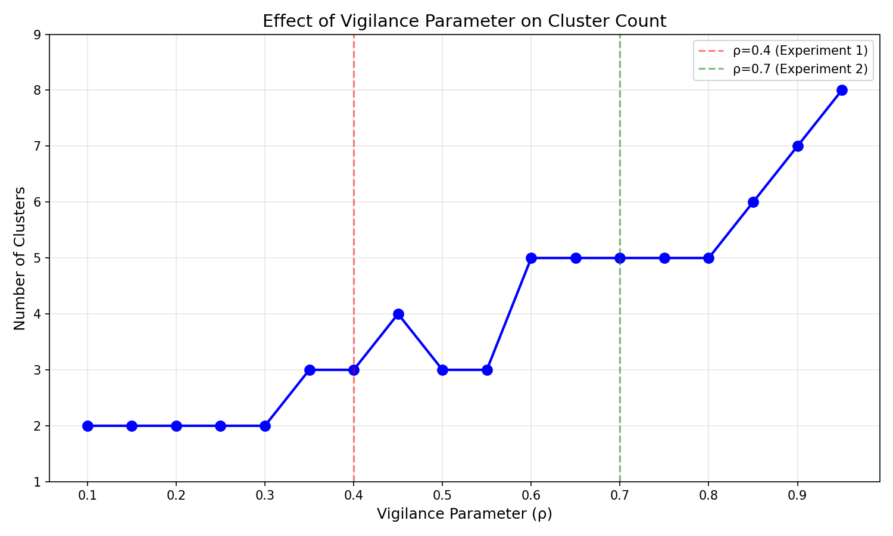
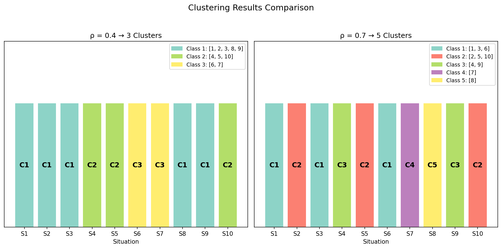

# Neural Network HW6: ART-1

ART-1 (Adaptive Resonance Theory 1) implementation for industrial process classification.

## Problem

Classify 10 industrial process situations (each with 16 binary status variables) into groups using unsupervised learning.

## Usage

```bash
uv run art1.py              # Basic version
uv run art1_with_plots.py   # With visualization
```

## Results

The vigilance parameter (ρ) controls classification granularity:

| ρ | Clusters |
|---|----------|
| 0.3 | 2 |
| 0.4 | 3 |
| 0.7 | 5 |
| 0.9 | 7 |




